# Bond
Bond is a child-friendly journaling website that encourages kids aged 5 and up to express themselves through creativity, reflection, and fun printable activities. Inspired by the idea that children grow through love, imagination, and emotional connection, Bond offers a space where writing becomes magical.
Children can explore a variety of printable journals, reward charts, and mood trackers — all designed to build confidence, independence, and mindfulness. Whether a child wants to start a gratitude journal, track habits, or express emotions through colours, Bond gives them the tools to do so in a playful, safe, and accessible way.
The project uses HTML, CSS, and Bootstrap focusing on responsive design to ensure accessibility across desktop, tablet, and mobile screens.  
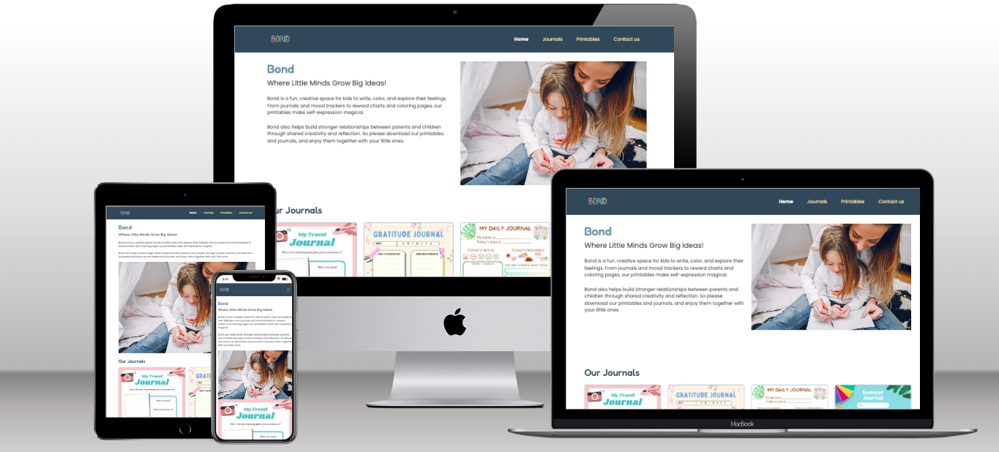

## Table of Contents
- [Bond](#bond)
- [Rationale](#rationale)
- [User Goals](#user-goals)
- [User Stories](#user-stories)
  - [As a child, I want:](#as-a-child-i-want)
  - [As a parent, I want:](#as-a-parent-i-want)
  - [As a teacher, I want:](#as-a-teacher-i-want)
  - [As a user, I want:](#as-a-user-i-want)
- [Target Audience](#target-audience)
- [Wireframe](#wireframe)
  - [Iphone wireframe](#iphone-wireframe)
  - [Ipad wireframe](#ipad-wireframe)
  - [Desktop wireframe](#desktop-wireframe)
- [Design Choices](#design-choices)
  - [Typography](#typography)
  - [Colour Scheme](#colour-scheme)
  - [Responsive Design Media Queries](#responsive-design-media-queries)
- [Images](#images)
- [Features](#features)
  - [Navigation Bar](#navigation-bar)
  - [Home Section](#home-section)
  - [Journals Section](#journals-section)
  - [Benefits of Journaling Section](#benefits-of-journaling-section)
  - [Printables Section](#printables-section)
    - [Mindfulness Strategies & Inspirational Words](#mindfulness-strategies--inspirational-words)
    - [Planning & Chore Charts](#planning--chore-charts)
    - [Reward Charts & Stickers](#reward-charts--stickers)
  - [Contact Us Section](#contact-us-section)
  - [Footer Section](#footer-section)
- [Future enhancement](#future-enhancement)
- [Technologies used](#technologies-used)
  - [Languages](#languages)
  - [libraries and frameworks](#libraries-and-frameworks)
  - [Tools](#tools)
- [Tests](#tests)
  - [Bugs](#bugs)
  - [Responseviness tests](#responseviness-tests)
  - [Code validation](#code-validation)
    - [HTML Validation](#html-validation)
      - [The main page index](#the-main-page-index)
      - [Subscribed Successfully page](#subscribed-successfully-page)
      - [Successfully contacted feedback page](#successfully-contacted-feedback-page)
    - [CSS Validation](#css-validation)
  - [User stories tests](#user-stories-tests)
  - [Lighthouse Testing](#lighthouse-testing)
- [Deployment](#deployment)
  - [Fork the project](#fork-the-project)
  - [To clone the project](#to-clone-the-project)
- [Credits](#credits)

# Rationale
Bond was created to provide children aged 5 and above with a fun, creative, and emotionally supportive space to express themselves through journaling. The project was inspired by the belief that children grow through love, creativity, and connection,yet most journaling platforms are designed for adults.

Bond bridges that gap by offering colourful, printable journals and resources that encourage reflection, mindfulness, and positive habits. It empowers children to explore emotions in a safe, engaging way while helping parents and teachers nurture emotional intelligence and family bonding through shared creative activities.

# User Goals
- Children want a fun and colorful space to write, color, and feel proud of their ideas.
- Parents want tools to help their children become more mindful, independent, and confident.
- Teachers may want printable resources for classroom journaling or group reflections.

# User Stories
 ## As a child, I want:
- To choose different types of journals, so I can write about my day, feelings, or things I’m thankful for.
- The journals to look fun and colorful, so I feel excited to write in them.

## As a parent, I want:
- I want to be able to subscride so I can recieve notifications about new, free and safe journaling resources that help my child grow emotionally and creatively.
- To print reward charts that help them build good habits like kindness, reading, or helping at home.

 ## As a teacher, I want:
- A simple and child-friendly website to recommend to parents or colleagues.
- A way for children to express themselves outside of academic tasks — through drawing, writing, and reflection.
- Tools like emotion charts and sticker rewards to motivate positive behaviour in the classroom.

## As a user, I want:
- To learn about the benefits of journaling, so I can understand how it supports children's creativity, emotional growth,self-expression and enhance family bond.
- To access journals and printables easily  so I can use them offline in a creative way.
- To tell what I’d like to see next — like new journals or sticker designs — so I feel heard and included.
- To be able to use the website on a range of devices (phone, tablet, desktop), so I can access content wherever I am.
- To be able to send a message or suggestion about the content of the website, so I can contribute ideas or ask for new features

# Target Audience:
Children aged 5+.
Parents and Guardians.
Teachers and Educators.
Therapist.

# Wireframe:
I created wireframes using Balsamiq Wireframes. This helped me visualise the structure and flow of each page before starting the coding process. I focused on making the design clear, simple, and responsive — ensuring it would look good on all screens.

### [Iphone wireframe](docs/phone-wireframe.pdf)
### [Ipad wireframe](docs/Ipad-wireframe.pdf)
### [Desktop wireframe](docs/Desktop-wireframe.pdf)

# Design Choices
## Typography
To keep the design friendly, playful, and easy to read for children, I selected two Google Fonts:
Fredoka – used for headings and titles. This rounded, bold font adds a fun and child-like feel to the site, making it more inviting for younger users.
Poppins – used for body text. It is clean, modern, and highly readable, which helps maintain clarity across different devices and screen sizes.
Both fonts complement each other visually and support the calm, creative tone of the website.

## Colour Scheme
The colour palette for Bond was carefully chosen to reflect creativity, warmth, and emotional wellbeing. The soft pastel tones are friendly and appealing to children, while maintaining good readability and contrast.

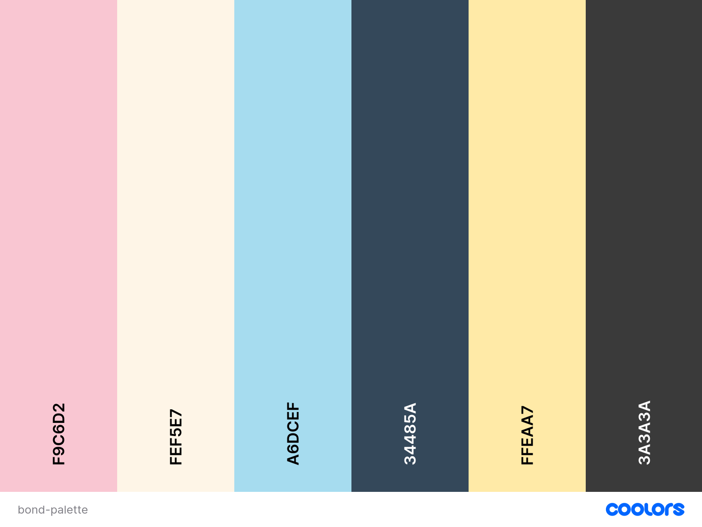

To ensure the website is accessible and the textis readable for users, I used Contrast Grid to testhe contrast between background and the text colors.

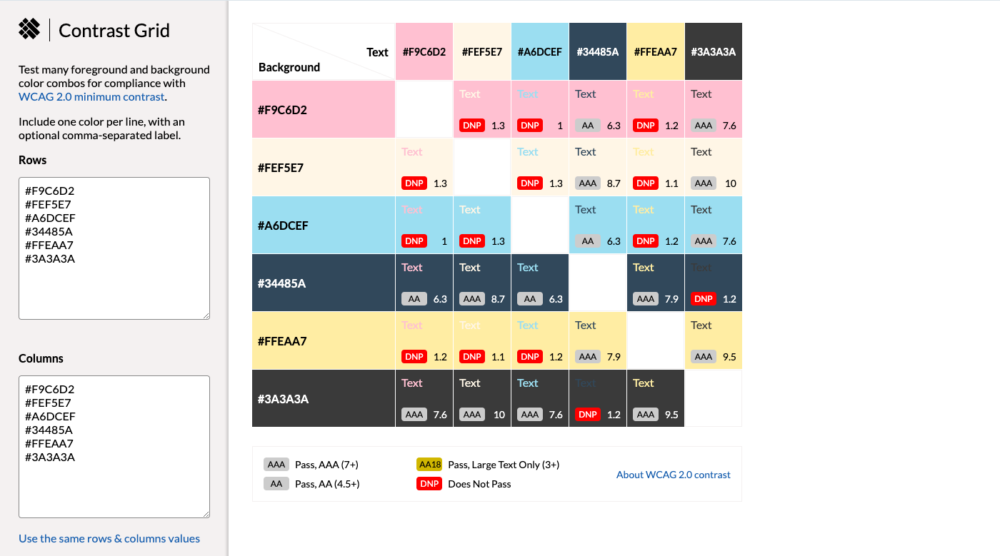

## Responsive Design Media Queries
The website was built with a responsive design approach to ensure it works well on a wide range of devices, including mobiles, tablets, and desktops. The goal of this design is to provide a consistent and user-friendly experience for all users, no matter what device they are using.

| Screen Size / Device        | Media Query                        | Adjustments Made                                                                 |
|------------------------------|------------------------------------|---------------------------------------------------------------------------------|
| **≤ 412px (extra small)**   | `@media screen and (max-width: 412px)` | Carousel height fixed at **214px**.                                             |
| **≤ 575.98px (small devices)** | `@media screen and (max-width: 575.98px)` | - Benefits grid becomes **1 column**   - Social media margin-top removed   - Subscribe margin-bottom removed |
| **≥ 768px (medium devices / tablets)** | `@media screen and (min-width: 768px)` | Journal card text min-height set to **143px**   Carousel height fixed at **427px** |
| **≥ 1024px (large devices / tablets)** | `@media screen and (min-width: 1024px)` | Journal card text min-height set to **120px**   Carousel height fixed at **596px** |
| **≥ 1200px (extra large devices)** | `@media screen and (min-width: 1200px)` | Journal card text min-height set to **192px**   Carousel height fixed at **425px**   Printable cards images set to **430px height** |

## Images 
Images for journals, printables, and the carousel were sourced from [Freepik](https://www.freepik.com/) and [Pinterest](https://uk.pinterest.com/). 
The logo was created with the assistance of [ChatGPT](https://chatgpt.com/).

# Features

## Navigation Bar

A responsive navbar that adapts to mobile and desktop screens.

Contains four main sections: Home, Printables, Journals and Contact Us 

 ## Home Section

Hero Carousel: A rotating image display featuring children journaling and some examples of our charts and activities.

Introduction Text: Explains the purpose of Bond – a fun and creative space for kids to write, to bond, and explore their feelings.

## Journals Section

Travel Journal: A printable journal to record adventures, trips, and discoveries. Includes space for writing, drawing, and rating experiences.

Gratitude Journal: Encourages children to reflect on what they are thankful for, with prompts like “Today I am grateful for” and “My intention for the day”.

Daily Journal: A structured space for children to track their daily activities, moods, and goals, helping them build routines.

Summer Journal: A seasonal journal to record holiday memories, new skills learned, and fun activities during the summer break.

## Benefits of Journaling Section

Boosts Emotional Intelligence: Helps children identify and express feelings.

Encourages Creativity & Self-Expression: Provides a safe space for storytelling, doodling, and reflection.

Improves Focus & Goal-Setting: Tools like reward charts support independence and responsibility.

Strengthens Parent-Child Bond: Promotes conversations and shared activities between parents and children.

## Printables Section

Organised into three categories with downloadable/printable resources:

### Mindfulness Strategies & Inspirational Words

Positive affirmations posters (“I am kind, I am brave, I am enough”).

A–Z coping skills sheet for mindfulness.

Sticky “Notes to Self” with encouraging messages.

“Take a Mindful B.R.E.A.K” guide for calming down.

### Planning & Chore Charts

Daily responsibilities chart (track simple tasks like tidying up or brushing teeth).

Homework tracker for assignments and due dates.

“My Daily Helper” visual schedule with icons for younger kids.

“All About Me” worksheet for children to share hobbies, favourites, and dreams.

### Reward Charts & Stickers

Behaviour chart to encourage positive habits.

chart with milestones.

Motivation stickers with phrases like “You are brave” and “Well done”.

Star sticker sheet for achievements.

## Contact Us Section

A simple contact form with fields for: Name, Email, Message. On successful submission, users are redirected to a Success page.

## Footer Section

  Subscribe Box: Allows users to enter their email to stay updated.

  Social Media Links: Icons for platforms like Facebook, Instagram, Twitter and Pinterest.

  Short Message: A friendly reminder about Bond’s mission – creativity, bonding, and growth.

# Future enhancement 
- Add a secure login system for parents and children.
- Add a download and print button, which allows the user to print or download any chart or journal directly from the website.
- Introduce rewards or badges when children complete journaling tasks.
- Let users pick themes, colours, or stickers before downloading charts and journals.
- Users can save their favourite journals, track their progress, and access previous entries.

# Technologies used

### Languages
- [HTML](https://developer.mozilla.org/en-US/docs/Glossary/HTML5)
- [CSS](https://developer.mozilla.org/en-US/docs/Web/CSS)
  
### libraries and frameworks
- [Bootstrap](https://getbootstrap.com/)
- [Google font](https://fonts.google.com/)
- [Favicon](https://favicon.io/)
- [Awsomefont](https://fontawesome.com/)

### Tools
- [GitHub](https://github.com/)
- [Balsamiq](https://balsamiq.com/product/)
- [W3C HTML Validation Service](https://validator.w3.org/)
- [W3C CSS Validation Service](https://jigsaw.w3.org/css-validator/)
- [Am I Responsive](https://ui.dev/amiresponsive)
- [Responsive Design Checker](https://responsivedesignchecker.com/)
- [WAVE Accessibility Tool](https://wave.webaim.org/)
- [Canva](https://www.canva.com/)
- [Color Palette Generator](https://coolors.co/)
- [Contrast Grid](https://contrastgrid.com/)
- [Squoosh to resize pictures](https://squoosh.app/)

  # Tests

  ## Bugs
During the development of the Bond website, several bugs were encountered that affected layout, functionality, and validation. These issues were identified through manual testing, W3C validators. Each bug was carefully reviewed and resolved where possible.

| **Bug** | **Status** | **Description** | **Steps to Resolve** |
|--------------|------------|-----------------|-----------------------|
| Mobile navbar didn’t close after click | Partially Fixed | On small screens the collapsed menu stayed open after clicking a link. | Added scroll-padding: 390px to html tag on a screen that is 820px or less.|
| Contact form 405 error |  Fixed | Submit button showed “405 Not Allowed” because GitHub Pages doesn’t support POST. | Changed `method="post"` to `method="get"` to redirected to `success.html`. |
| Success page not showing |  Fixed | After form submission, success page didn’t load. | Ensured `success.html` exists at repo root . |
| Repo showed README instead of site |  Fixed | GitHub Pages opened README.md instead of the website. | changed the name of the main page to`index.html` instead of `home.html` as github only recognize `index.html`. |
| Multiple `<h1>` warnings | Fixed | Validator flagged multiple `<h1>` tags across sections. | Kept one `<h1>` for main page title, changed others to `<h2>` and `<h3>`. |
| Stray end tag error | Fixed | HTML validator reported an extra closing `
`/`</section>`. | Checked nesting and removed extra tag. |
| Navbar active link not working | Unresolved | `:active` only applied while clicking on Home. | I need to use Javascript in order to fix this problem |
| Carousel height inconsistent |  Fixed | Images stretched/jumped at different breakpoints. | Set fixed heights in media queries. |

## Responseviness tests

I have simultaneously tested the responsiviness of the website using DevTools browser for google Chrome. I  the mobile-first strategy and verified all of my modifications using the DevTools browsers for Google Chrome and Microsoft Edge. Deployed versions were tested using the external website Responsive Design Checker. The Am I Responsive website was another external source that was used to obtain a unified view of different device breakpoints.

| **Size** | **Device Example** | **Navigation** | **Element Alignments** |**Content Placement**| **Functionalty**| **Notes**|
|------------------|-----------------|---------------|--------------|------------|-----------------|-----------------------|
|sm	|Samsung Galaxy S5 S6 S7	|Good|	Good|	Good	|Good	|
|sm	|iPhone 6s plus/ 7 plus	|Good	|Good|	Good|	Good	||
|sm	|iPhone 14 PRO MAX|	Good	|Good	|Good	|Good	||
|md	|iPad MINI	|Good|	Good|	Good|	Good	|
|md|	Galaxy Tab S10|	Good|	Good|	Good|	Good	|
|md|	iPad Air	|Good|	Good	|Good	|Good	|
|lg|	iPad Pro|	Good	|Good|	Good|	Good	|
|xl|	Mackbook Air|	Good|	Good|	Good	|Good|
|xl|	HP Stream Laptop|	Good	|Good	|Good	|Good	|
|xxl|	Dell Lattitude	|Good|	Good	|Good	|Good	||
|xxl	|Desktop|	Good|	Good	|Good	|Good	|

## Code validation 
### HTML Validation
I used [W3C HTML Validation Service](https://validator.w3.org/) to test the code of three bond files:

#### The main page index
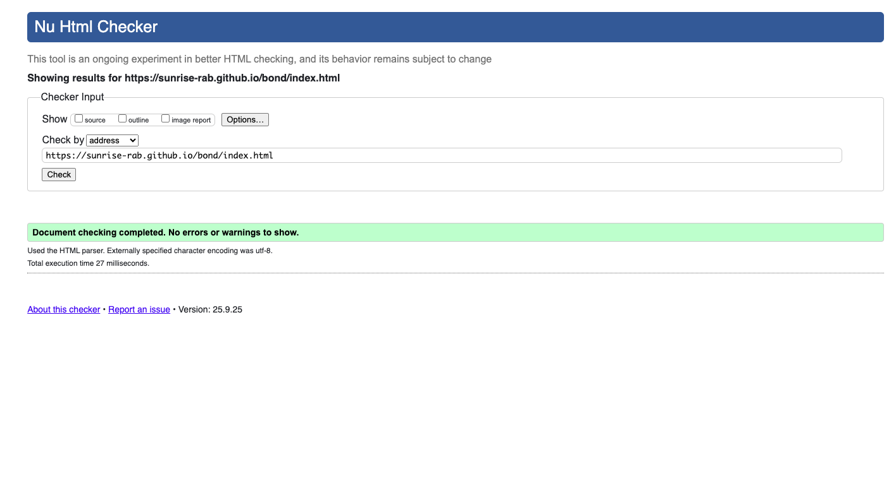

#### Subscribed Successfully page
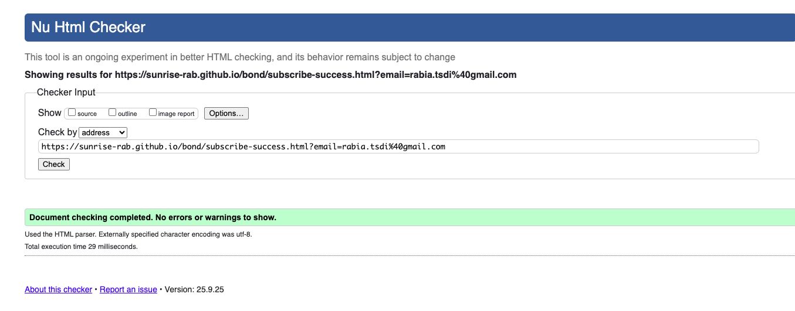

#### Successfully contacted feedback page.
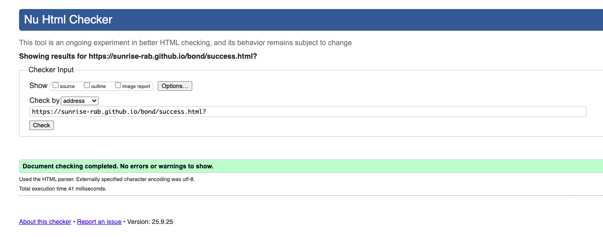

### CSS Validation
I used [W3C CSS Validation Service](https://jigsaw.w3.org/css-validator/) to test css file code. It all came up clean with no errors.
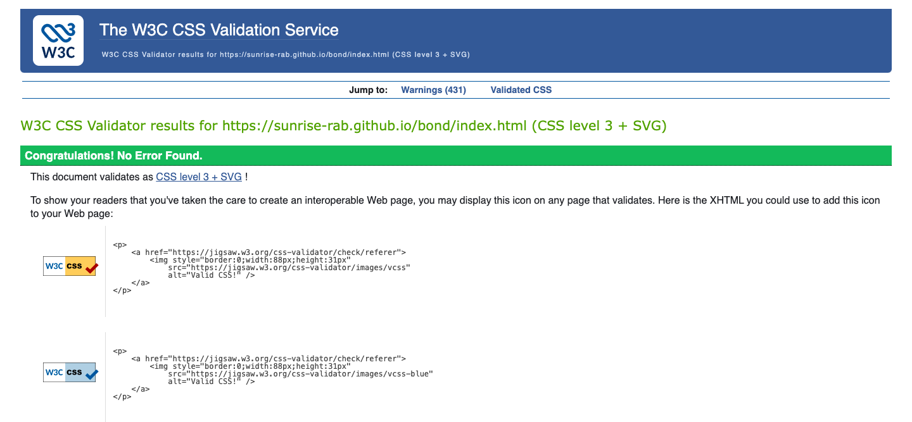

### User stories tests

| **User story** | **Result** | **Pass** | **proof** |
|--------------|------------|-----------------|-----------------------|
| As a child, I want To choose different types of journals, so I can write about my day, feelings, or things I’m thankful for.| The website displays wide rage of journals to choose from| Yes|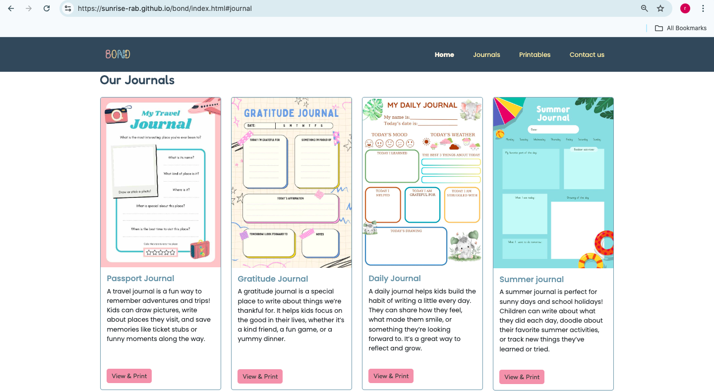 |
|As a user, I want To tell the website what I’d like to see next — like new journals or sticker designs — so I feel that my child is heard and included.|There is a contact form in Bond website that allows parents to get in touch and suggest new journals or resources to be added| Yes|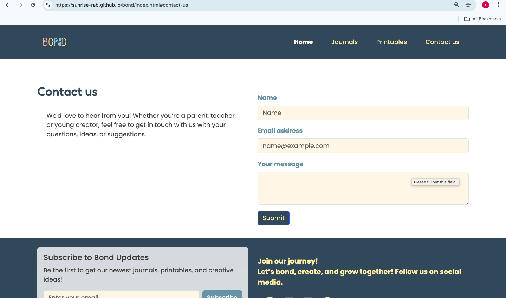 |
|As a user, I want To learn about the benefits of journaling, so I can understand how it supports children's creativity, emotional growth,self-expression and enhance family bond.| There is a section in the Bond website it states few benefits of journaling individually or as a family|yes|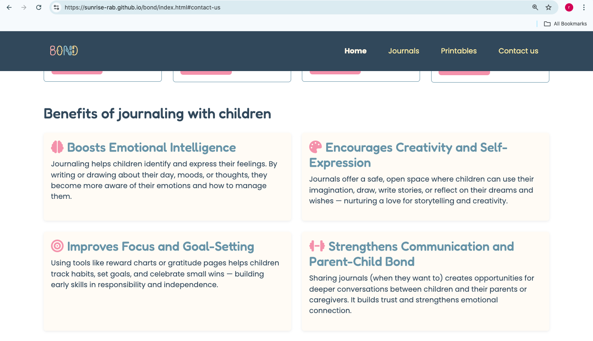|
| As a parent, I want to be able to subscride so I can recieve notifications about new, free and safe journaling resources that help my child grow emotionally and creatively.|In the footer of Bond website there is a form where you can enter your email address and press on subscribe button to receive the newest updates.|yes|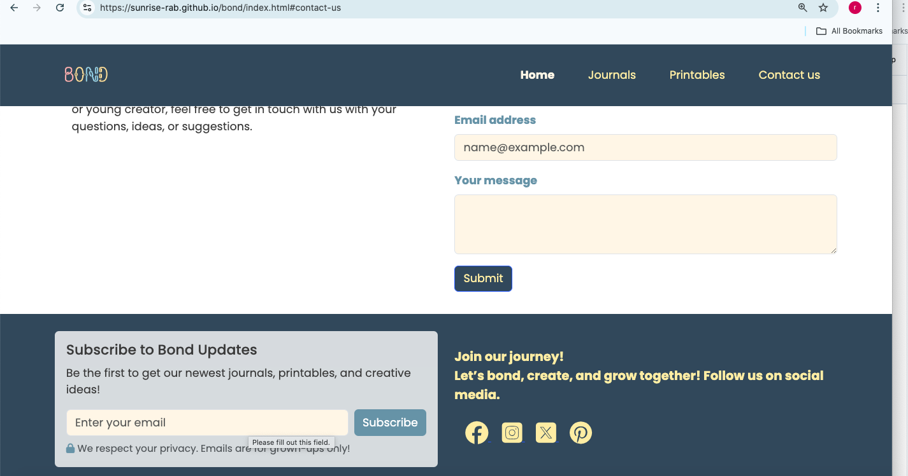|
|As a child, I want the journals to look fun and colorful, so I feel excited to write in them| Bond offers a wide range of colourful, child-friendly printables and journals to choose from|yes| 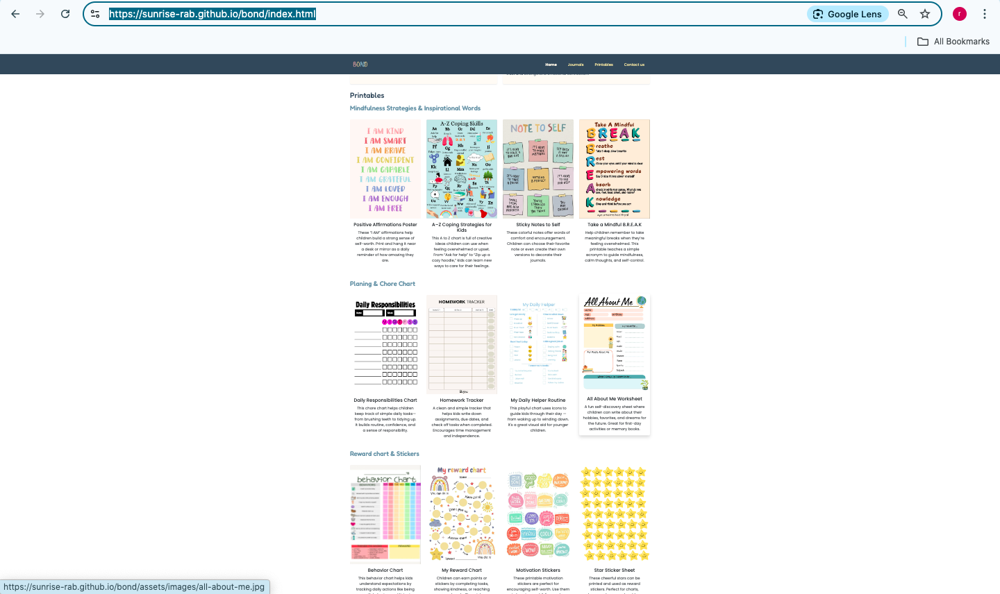|
|As a user, I want access journals and printables easily  so I can use them offline in a creative way.| In journals section if you press view & print button the journal will open in a diffrent tab then you can use the three dots on the write of the browser then you can press print this will allow you to print the document or save it in your computer.| yes | 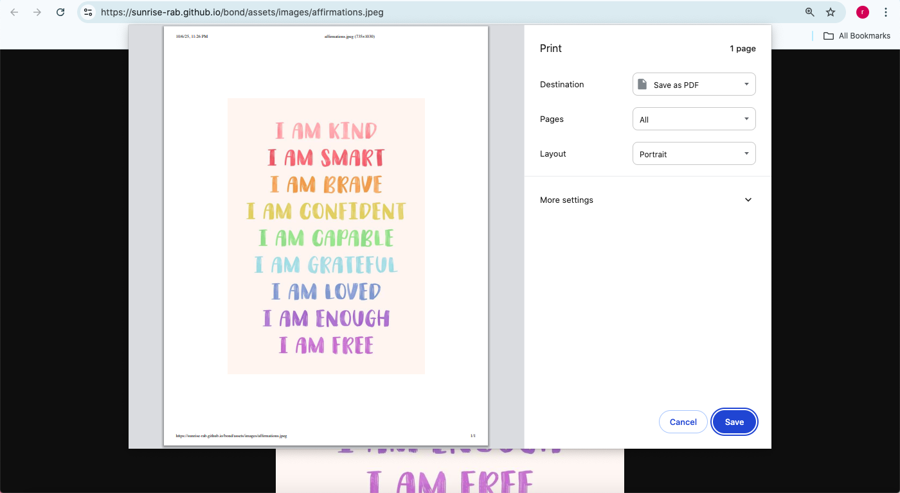|
| As a user, I want to be able to use the website on a range of devices (phone, tablet, desktop), so I can access content wherever I am.| the website is been tested on phone, tablet and desktop screens The all work perfect without any issues.| yes||

## Lighthouse Testing
Bond has been tested in the [Chrome Dev Tools](https://pagespeed.web.dev/) and [Microsoft Edge Dev Tools](https://learn.microsoft.com/en-us/microsoft-edge/devtools/overview?tabs=cmd-Windows) using Lighthouse Testing tool which inspects and scores the website for the following criteria:

Performance - how quickly a website loads and how quickly users can access it.
Accessibility - test analyses how well people who use assistive technologies can use your website.
Best Practices - checks whether the page is built on the modern standards of web development.
SEO - checks if the website is optimised for search engine result rankings.
 - Tests for Desktop on Lighthouse Chrome
 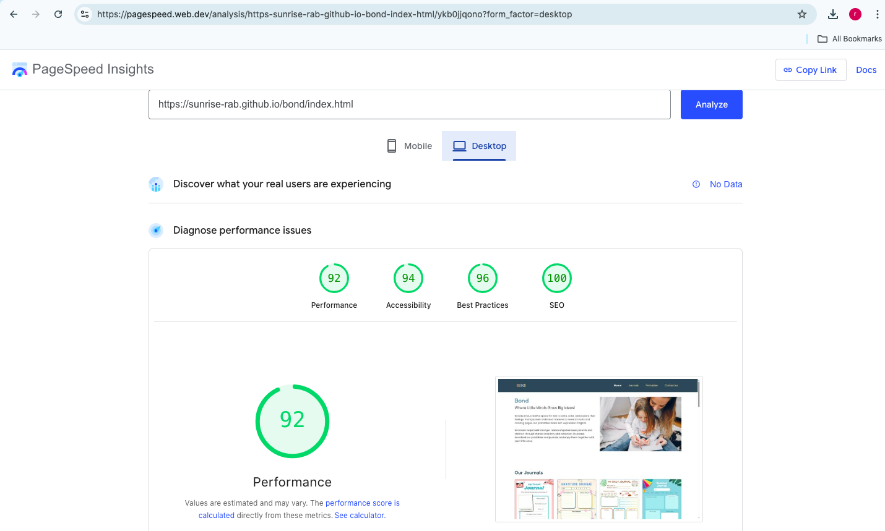  
 - Tests for Phone on Lighthouse Chrome
 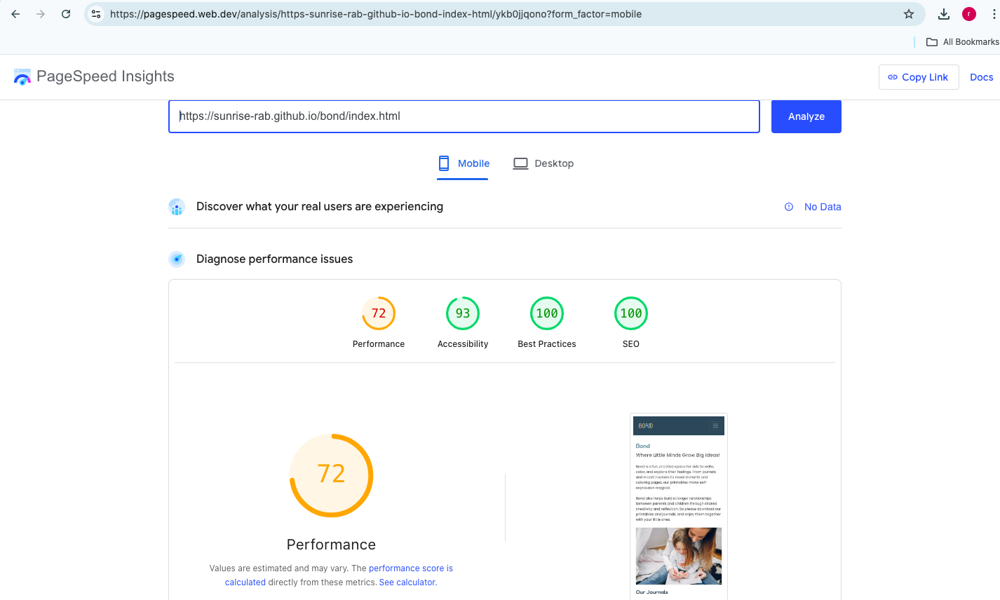  
 - Tests for Desktop on Edge Lighthouse 
 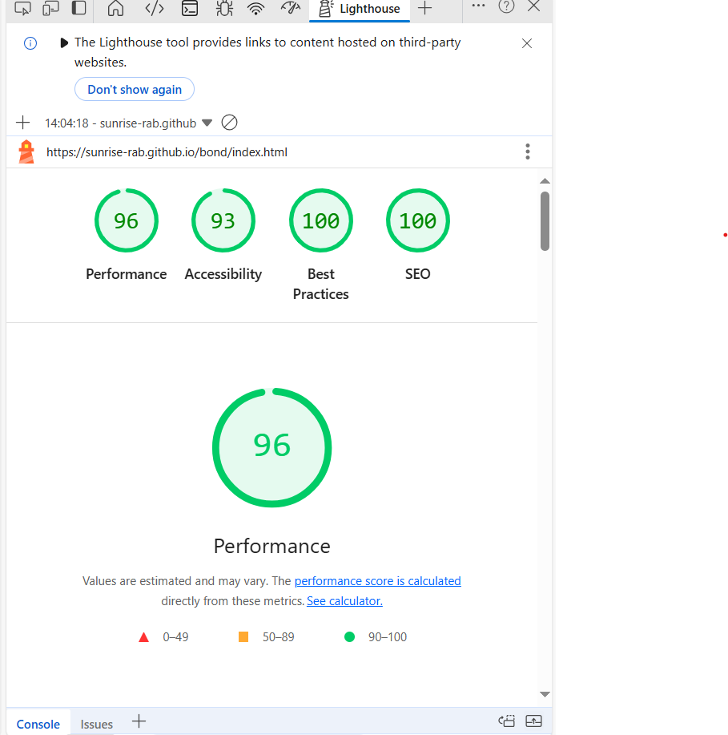  
 - Tests for Phone on Edge Lighthouse   
 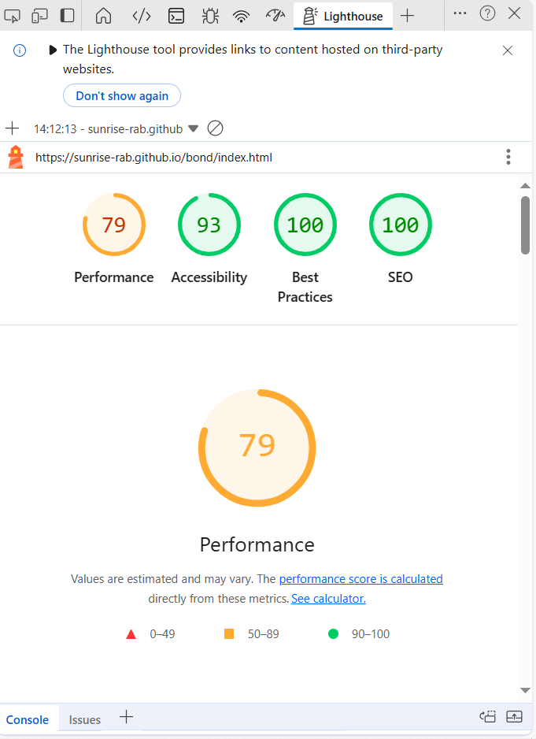

# Deployment

Bond was deployed early in the process to GitHub pages via the following steps:

- Navigate to the repository on GitHub and click on Settings.
- In the side navigation and select Pages.
- In the None dropdown and choose Main.
- Click on the Save button.
- The website is now live at https://sunrise-rab.github.io/bond/index.html.

Any changes required to the website, they can be made, committed and pushed to GitHub.

## Fork the project
Forking the GitHub repository allows you to create a duplicate of a local repository. This is done so that modifications to the copy can be performed without compromising the original repository.

- Log in to GitHub.
- Locate the repository.
- Click to open it.
- The fork button is located on the right side of the repository menu.
- To copy the repository to your GitHub account, click the button.
  Now you have your own version you can commit, edit, and even make pull requests to the original project.
  
  ## To clone the project
- Log in to GitHub.
- Navigate to the main page of the repository and click Code.
- Copy the URL for the repository.
- Open your local terminal or VS Code.
- Change the current working directory to the location where you want the cloned directory.
- Type git clone, and then paste the URL you copied earlier.
- Press Enter to create your local clone.

# Credits

- Feedback, advice and support
  + [Simen Daehlin](https://github.com/Eventyret)
- Code inspiration and learning content:
  + Boardwalk project.
  + [W3C Schools](https://www.w3schools.com/)
  + [Mindfulmazing](https://www.mindfulmazing.com/)
   
- Visual content:
  + [Colors](https://coolors.co/)
  + [Contrast Grid](https://contrastgrid.com/)
   
- Images:
  + [Canva](https://www.canva.com/)
  + [Pinterest](https://uk.pinterest.com/)
     - [Etsy](https://uk.pinterest.com/search/pins/?q=etsy&rs=typed)
     - [Natasha](uk.pinterest.com/natashalh/)
    
